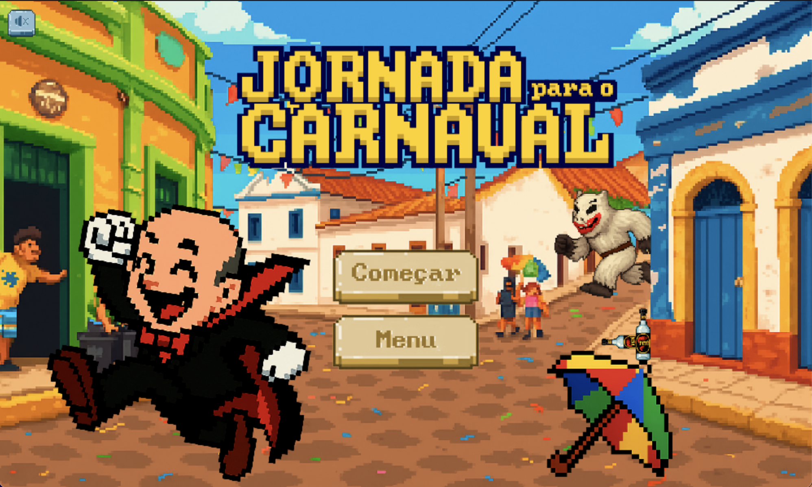
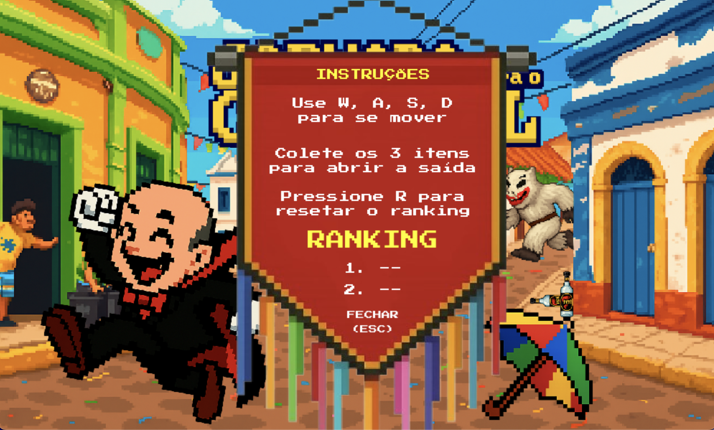
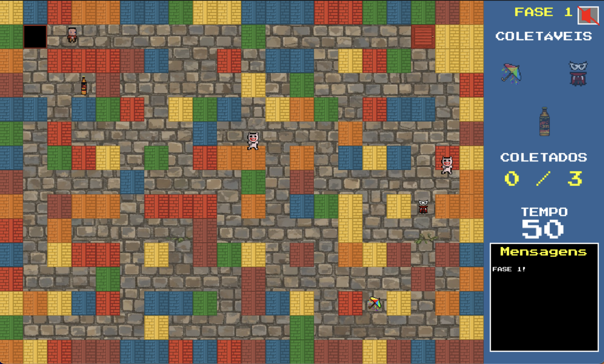
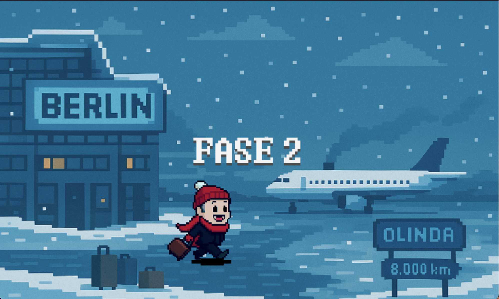
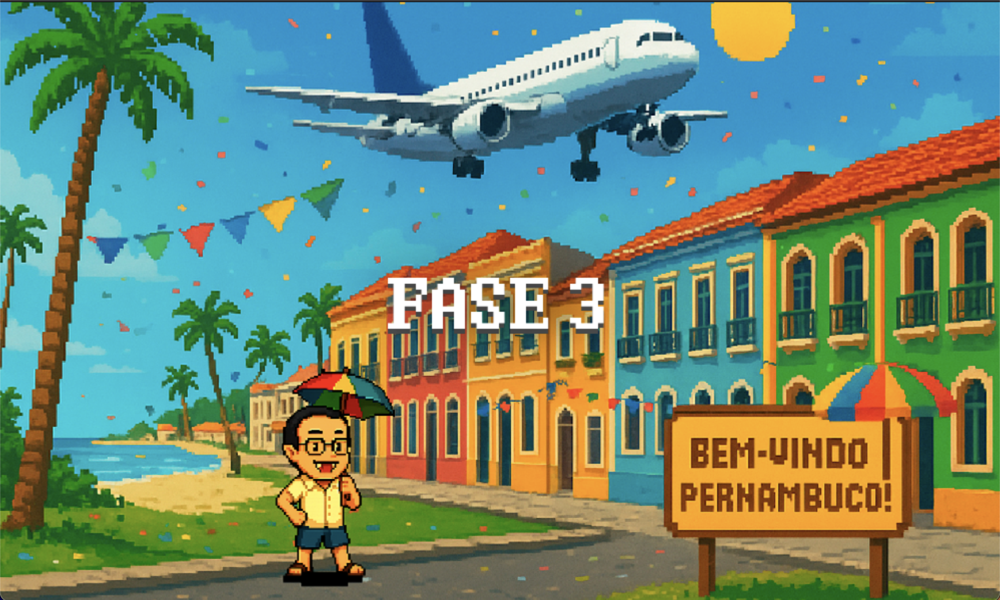
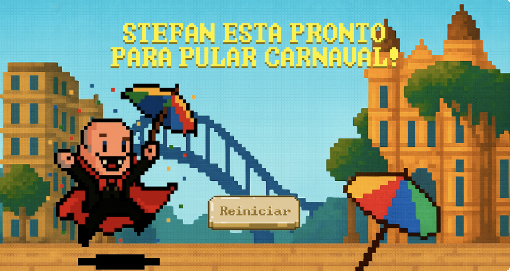

## Jornada para o Carnaval

## 📜 Descrição do Projeto

### História
Na vibrante cidade de Olinda, durante o Carnaval, a alegria foi interrompida por um grupo de *La Ursas* endiabradas que espalharam confusão pelos becos e ladeiras. Entre confetes e frevos, o *Professor Stefan* — renomado conhecedor das tradições e lendas carnavalescas — se vê em uma missão urgente: recuperar três itens sagrados do carnaval que foram roubados e dispersos pelo labirinto da cidade:

* **Sombrinha de Carnaval**: Símbolo da dança e do frevo.
* **Máscara**: Guardiã do mistério e do anonimato.
* **Garrafa de Pitu**: Energia e ousadia em forma líquida.

Mas cuidado: *as La Ursas querem dinheiro* e, como diz a marchinha, "quem não dá é pirangueiro". Cada encontro com elas custará caro — e o preço é a perda de tempo precioso.

### Objetivo
O jogador deve guiar o Professor Stefan pelos labirintos de cada fase, desviando das La Ursas para coletar os três itens antes que o tempo acabe. Somente reunindo todos os itens será possível abrir a porta de saída, avançar e, ao final, restaurar a paz carnavalesca em Olinda.

### Mecânicas e Fases
O jogo possui **3 fases fixas**, cada uma com dificuldade crescente:

* **Fase 1:** Ao encostar em uma La Ursa, o jogador perde **2 segundos** e volta ao início da fase.
* **Fase 2:** A penalidade aumenta. Ao encostar em uma La Ursa, o jogador perde **4 segundos** e volta ao início. Além disso, o efeito da Pitú dura **2 segundos** a mais que na fase anterior.
* **Fase 3:** Dificuldade máxima. Um único toque em uma La Ursa resulta em **game over**. Além disso, o efeito da Pitú dura **2 segundos** a mais que na fase anterior.

Os coletáveis concedem efeitos especiais com duração de 7 segundos cada:
* 🎵 **Sombrinha**: Toca uma música tema do Carnaval, animando a jornada.
* 🎭 **Máscara**: Deixa o jogador invisível para as La Ursas, permitindo passagem segura.
* 🍾 **Garrafa de Pitu**: Inverte os comandos do jogador, adicionando um desafio de coordenação.


## Participantes do Projeto:

  * Mirella Laura Fontinelle Martins \<mlfm\>
  * Willian Neves Rupert Jones \<wnrj\>
  * Maria Luísa Brandão Amaral \<mlba\>
  * Maria Eduarda Torres da Costa Lira \<metcl\>
  * Luiz Miguel Freitas da Silva \<lmfs3\>
  * Amanda Trinity Gomes Nascimento \<atgn\>

## Organização e Desenvolvimento de Jogo:

Nosso grupo se dividiu para desenvolver o jogo de maneira mais eficiente. Alguns membros ficaram com a parte de programação do jogo e outros com a parte visual e de animações. Tivemos reuniões online e presenciais para alinhamento de ideias, revisão de código e planejamento. Todos participaram de forma ativa e colaborativa.

## 🤝 Divisão de Tarefas

| **Dupla** | **Tarefas** |
| :--- | :--- |
| Amanda Trinity Gomes Nascimento e Willian Neves Rupert Jones | Código principal |
| Maria Eduarda Torres da Costa Lira e Maria Luísa Brandão Amaral | Personagens, sons, cenários e coletáveis |
| Mirella Laura Fontinelle Martins e Luiz Miguel Freitas da Silva | Tela de início e tela final |


## 🏛️ Arquitetura do Projeto

```bash
PROJETO/                          
│── assets/                    # Recursos estáticos do projeto
│   ├── imagens/               # Imagens usadas no projeto
│   ├── sons/                  # Arquivos de áudio (efeitos sonoros músicas)
│   ├── fontes/                # Arquivos de fontes
│   ├── sprites/               # Sprites utilizados no jogo    
│── src/                       # Código fonte do projeto
│   ├── coletaveis/            # Módulo para objetos coletáveis no jogo
│   │   ├── item.py            # Definição dos objetos coletáveis
│   │   ├── fantasiaCarnaval.py # Coletável: fantasia de carnaval
│   │   ├── garrafaPitu.py     # Coletável: garrafa de Pitu
│   │   ├── sombrinha.py       # Coletável: sombrinha
│   ├── labirinto/             # Lógica do labirinto
│   │   ├── labirinto.py       # Definição e lógica do labirinto
│   ├── mecanicas/             # Lógica de movimentação dos personagens
│   │   ├── movimento.py       # Movimentação dos personagens no jogo
│   │   ├── level.py           # Lógica de transição de fase
│   │   ├── eventos.py         # Processa as teclas de entrada do jogador
│   ├── personagem.py         # Processa as teclas de entrada do jogador
│   ├── personagem.py         # Movimentação dos personagens no jogo
│   ├── personagens/           # Módulo dos personagens do jogo
│   │   ├── laursa.py           # Definição do personagem LaUrsa
│   │   ├── professor.py       # Definição do personagem professor
│   ├── telas/                 # Definição das telas e interfaces gráficas
│   │   ├── telas.py           # Lógica de renderização das telas
│   ├── utils/                 # Funções auxiliares e utilitárias
│   │   ├── audio.py           # Manipulação de áudio (efeitos sonoros e músicas)
│   │   ├── constantes.py      # Constantes utilizadas no código
│   │   ├── desenho.py         # Funções de desenho gráfico
│   │   ├── setup.py           # Configurações iniciais do projeto
│   │   ├── botao.py           # Botão personalizado para interação do jogador
│   │   ├── pontuacao.py       # Carrega e salva os melhores tempos para o RANKING
│   
│── main                   # Arquivo principal do projeto
│
│── .gitignore               # Arquivo de configuração do projeto (scripts, etc.)
│── requierements.txt        # Lista de bibliotecas necessárias
│── README.md                # Informações sobre o projeto
```
Adotamos o método **Feature Branch Workflow** no Git. A ramificação `main` foi mantida estável, e cada nova funcionalidade foi desenvolvida em uma ramificação separada (`feature`) para evitar modificações indesejadas no código principal e manter o processo mais organizado.

## 🖼️ Galeria do Projeto (Capturas de Tela)

*(Esta seção deve ser preenchida com as imagens do jogo em funcionamento)*

* **Tela Inicial:** Apresentação do jogo e início da aventura.

**

 **MENU:** Aba de MENU com instruções e RANKING.

**

* **Gameplay - Fase 1:** O Professor Stefan no labirinto.

**
* **Tela de Transição 1:** Mensagem exibida entre as fases 1 e 2.

**
* **Tela de Transição 2:** Mensagem exibida entre as fases 2 e 3.

**
* **Tela de Derrota (Tempo):** Exibida quando o tempo acaba.

**
* **Tela de Vitória:** A celebração final ao completar o jogo.

**

## 🛠️ Ferramentas e Bibliotecas Utilizadas

| Ferramenta | Justificativa de Uso |
| :--- | :--- |
| **Pygame** | Biblioteca padrão para o desenvolvimento de jogos 2D em Python. Foi escolhida por sua vasta documentação, simplicidade para iniciantes e por ser um requisito do projeto, permitindo-nos focar nas mecânicas do jogo. 
| **Piskel** | Ferramenta online e gratuita para a criação de pixel art e animações. Foi fundamental para que a equipe de design pudesse criar os sprites do Professor Stefan, das La Ursas e dos coletáveis de forma colaborativa e acessível. |
| **VSCode** | Ambiente de desenvolvimento integrado (IDE) moderno e robusto, com excelente suporte para Python, depuração de código e integração nativa com o Git, o que agilizou nosso fluxo de trabalho. |
| **GitHub** | Plataforma para hospedagem de código e controle de versão. Essencial para o trabalho em equipe, permitindo a colaboração simultânea, o gerenciamento de tarefas e a manutenção de um histórico de alterações seguro. |

## 🎢 Desafios e Lições Aprendidas

### Qual foi o maior erro cometido durante o projeto? Como vocês lidaram com ele?
Adquirir todas as boas ptáticas de commit e pull / push foram os maiores erros cometido pelo grupo. Em algumas ocasiões, esquecemos ou utilizamos de forma errônea os uploads para o repositório, o que gerou bastante confusão e resultou em códigos desconexos, mistura de informações e perda de arquivos. Para lidar com essa falha, aumentamos nossa frequência de comunicação para ficarmos cientes do que cada um produzia e passamos a nos atentar mais a tudo que era submetido no repositório.

### Qual foi o maior desafio enfrentado durante o projeto? Como vocês lidaram com ele?
O gerenciamento do tempo, somado à falta de conhecimento prévio de algumas ferramentas, foi o nosso maior desafio. O acúmulo de obrigações da faculdade, como provas e outros trabalhos, limitou bastante o tempo disponível para a criação do jogo. Para superar isso, tivemos que planejar muito bem o que iríamos executar e dividir as tarefas de forma eficiente entre os membros do grupo para agilizar a estruturação do projeto.

### Quais as lições aprendidas durante o projeto?
As maiores lições que levamos deste projeto foram a importância do trabalho em equipe e da comunicação. Programar em conjunto foi um desafio novo e inspirador para todos, que nos ensinou a segmentar tarefas, aprimorar nossas formas de comunicação e, principalmente, a auxiliar uns aos outros para alcançar um objetivo comum.
   
## 🧠 Conceitos da Disciplina Aplicados

* **Funções:** Foram essenciais para modularizar o projeto. O código foi dividido em blocos lógicos e independentes, como `desenhar_labirinto()`, `mover_personagem()` e `verificar_colisoes()`, o que tornou o desenvolvimento mais organizado e o código mais legível.

* **Classes:** Utilizadas para representar os elementos do jogo como objetos. O `Professor Stefan` e as `La Ursas`, por exemplo, foram definidos como classes para encapsular seus atributos (posição, velocidade) e comportamentos (movimento, animação).

* **Listas:** Empregadas para gerenciar conjuntos de dados dinâmicos. Por exemplo, a estrutura do labirinto foi representada como uma lista de listas (matriz), e as posições dos coletáveis e das La Ursas em cada fase foram armazenadas em listas para facilitar sua renderização e verificação.

* **Dicionários:** Usados para associar chaves a valores, facilitando o gerenciamento de estados e configurações. Um exemplo seria armazenar as propriedades dos coletáveis, como seus nomes e os efeitos que aplicam ao jogador.

* **Laços de Repetição:** São o coração do jogo. O loop principal (`while`) garante que o jogo continue rodando, atualizando a tela e processando eventos. Laços `for` foram usados para percorrer a matriz do labirinto para desenhá-lo, renderizar todos os coletáveis na tela e verificar colisões a cada frame.

* **Condicionais:** Fundamentais para toda a lógica do jogo. Foram usadas para:
    * Verificar qual tecla foi pressionada para movimentar o Professor Stefan (`if event.key == K_UP`).
    * Detectar colisões com as paredes, com as La Ursas e com os itens.
    * Verificar se todos os coletáveis foram pegos para liberar a saída.
    * Controlar qual tela (inicial, jogo, game over) deve ser exibida.

* **Tuplas:** Utilizadas para armazenar dados imutáveis, principalmente constantes. As cores no padrão RGB, como `PRETO = (0, 0, 0)`, e as dimensões da tela foram definidas como tuplas para garantir que seus valores não fossem alterados acidentalmente durante a execução do jogo.
## 🎮 Como Jogar

1.  **Preparar o ambiente**
    
    Antes de começar, verifique se você tem o **Python 3.x** instalado. Depois, no terminal (dentro da pasta do projeto), instale as dependências necessárias executando:
    
    ```bash
    pip install -r requirements.txt
    ```

2.  **Rodar o Jogo**
    
    Com as dependências instaladas, basta iniciar o arquivo principal:
    
    ```bash
    python main.py
    ```

3.  **Controles**
    
    Use os seguintes comandos para jogar:
    
    | Entrada | Ação |
    | :--- | :--- |
    | `Setas` ou `W/A/S/D` | Movimentar o personagem |
    | `Enter` | Começar ou confirmar |
    | `ESC` | Voltar ao menu |
    | `M` | Ligar/desligar som |
    | `Mouse` | Clicar nos botões da tela |
### Biblioteca Padrão Python

* **`os`**: Utilizado para a manipulação de caminhos de arquivos e diretórios.
* **`sys`**: Permite a interação com o sistema, sendo usado para encerrar o programa.
* **`random`**: Empregado na seleção aleatória de elementos (ex: texturas das paredes).
